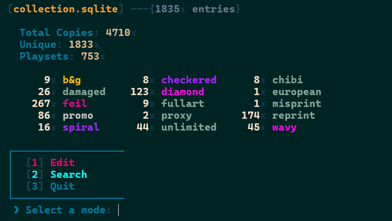
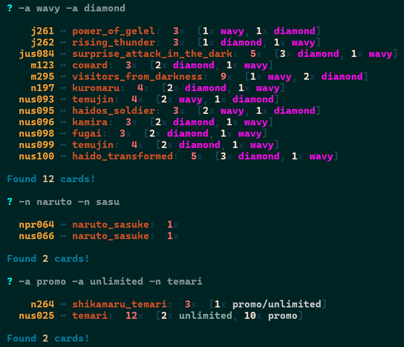
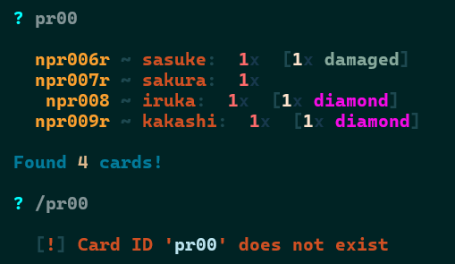
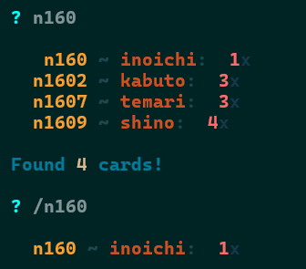
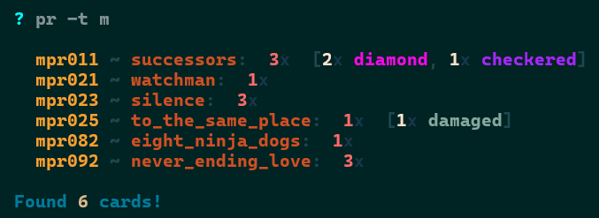
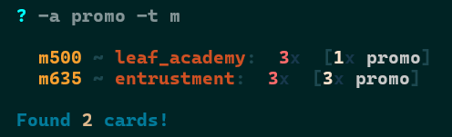

# Naruto CCG collection Manager

A simple script I made to keep track of my collection. Requires
* `Python`
	* `prompt_toolkit`
	* `sqlitedict`

After that, all you need is [manager.py](manager.py). Run it with

```
python manager.py
```

There are two modes of operation: `EDIT` and `SEARCH`. Pretty self-explanatory. There is no way to modify the collection in `SEARCH`.

`Up` and `Down` arrow keys allow for navigation of input history.



## \> `EDIT` mode

To edit an entry type a command:

&nbsp;&nbsp;&nbsp;&nbsp; `id` &nbsp; [`amount_to_add`] &nbsp; [-n `name`] &nbsp; [-a `art`] &nbsp; [-del]

(square brackets like `[OPTION]` indicate that `OPTION` is optional)

If an entry for the `id` already exists, it will be updated, otherwise, it will be created:

```
n001 						# creates an empty entry with id 'n001'
n001 -n naruto				# edits name (from nothing) to 'naruto'
n001 -n naruto_uzumaki		# edits name from 'naruto' to 'naruto_uzumaki'
n001 3 						# adds 3 copies (3 total)
n001 5 						# adds 5 copies (8 total)
n001 -2						# subtracts 2 copies (6 total)
n001 						# makes no changes. shows 'n001' info
n001 -del					# deletes entry (GONE FOR GOOD)

n001 1 -n naruto			# (re)creates 'n001' entry, this time setting the name and # of copies
n001 4 -a diamond			# adds 4 diamond copies (5 total)
n001 -1 -a diamond			# subtracts 1 'diamond' copy (4 total, 3 of which are 'diamond')
n001 1 -a wavy				# adds 1 'wavy' copy (5 total: 3 'diamond', 1 'wavy')
n001 -a diamond -del		# deletes (GONE FOR GOOD) 'diamond' tag. (leaving 2 total: 1 'wavy')
```

* the **words** of `name` (`-n`) and `art` (`-a`)
	* **are automatically turned into lowercase**
	* **must be connected** by something other than spaces. I suggest `_` or `-` :
		* `ghost_panic`
		* `ghost-panic`
		* `naruto-uzumaki_&_sasuke-uchiha`

(Technically, the same applies to `id`, though I recommend against using any special characters in it. See `Card ID` below.)


## \> `SEARCH` mode


To search for cards type a command:

&nbsp;&nbsp;&nbsp;&nbsp; [[/]`id`] &nbsp; [-t {`n`|`m`|`j`|`c`}] &nbsp; [-n `name`]... &nbsp; [-a `art`]...

(square brackets like `[OPTION]` indicate that `OPTION` is optional)

`...` indicate that `-a` and `-n` can be repeated however many times:



Prepend `id` with a slash `/` to search for an **exact match**:

 &nbsp;&nbsp; 

`-t` can only take as an argument `n`, `m`, `j` or `c`. E.g. with `Missions` (`m`):

| Promo Missions | Promo reprints of Missions |
| :---: | :---: |
|  |  |

---
---

<br>

### Card ID `id`

**Mandatory** in `EDIT`, **Optional** in `SEARCH`

> When specified (either mode), it must always be the **first** term in the command!

Can use whatever for a card entry `id`, though I **highly** recommend using the format

&nbsp;&nbsp;&nbsp;&nbsp; **letter indicating card `type` + printed card ID**

* Ninja
	* `nDDD` or `nDDDD`, `nusDDD`, `nprDDD`, `nprusDDD`, `nc0DD`, `nps00D` or `nex001`/`nex002` (*Naruto*/*Sasuke*)
* Mission
	* `mDDD`, `musDDD`, `mprDDD` or `mprus006` (*Big Boss*)
* Jutsu
	* `jDDD` or `jDDDD`, `jusDDD`, `jprDDD` or `jprus004`/`jprus014` (*Sharingan Eye*/*Multi Shadow Clone*)
* Client
	* `cDDD` or `cus001` (*Yukie Fujikaze*)

(where `D` is a digit) 

Card `type` (`-t`) is autodetected from the first letter of `id`

* If `id` does **not** start with `n`, `m`, `j` or `c`, e.g. `id` = `pr001`
	* the entry won't have a `type`
	* therefore, when **any** `type` is specified in a `SEARCH`, `pr001` is ignored no matter what

* Whereas an entry with `id` = `npr001`
	* gets `type` = `n` (for `Ninja`)
	* is found by `SEARCH`ing for `pr001` regardless, so there is hardly any downside to the recommended format

It shouldn't need to be longer than 8 characters, something like `nprus001` is as long as it gets.

---

### Name `-n`

**Optional**

Name a card whatever you want. Connect its words with `_`, `-`, ...

#### What I do

* Jutsu: excluding '*\<element\> Style:*'' from names for the 5 basic elements
* Ninja: ordinals in kage titles always use numbers (e.g. '3rd' instead of 'third')

---

### Art `-a`

**Optional**

Multipurpose tag. Use `-a` to track different alt arts, foils, condition, ... 
In the future, could maybe separate these into different options, but meh.

Connect its words with `_`, `-`, ... Note that `/` has a special effect for `-a`:

Using `/` to separate `-a` fields (optional) will treat them as different `-a` tags when displaying the `-a` stats at launch

* `n209 ~ nawaki:  3x total copies  [2x promo, 1x unlimited_foil]` **counts as** `2x promo` **+** `1x unlimited_foil`

* `n209 ~ nawaki:  3x total copies  [2x promo, 1x unlimited/foil]` **counts as** `2x promo` **+** `1x unlimited` **+** `1x foil`

I prefer using `/`.

When `-a` is specified in `EDIT`, it alters the behavior of `-del` to delete only said tag (as opposed to deleting the card entry).

#### What I do

Cards whose **original** print corresponds to a tag do **not** carry that tag:

* super-rares do **not** have a `foil` `-a` tag
* cards whose original print is full art/chibi do **not** have a `fullart`/`chibi` `-a` tag
* an original print promo card (`prDDD`/`prUSDDD`/`psDDD`/`nexDDD`) does **not** have a `promo` `-a` tag

because I wish to distinguish between when *some* version is the original and when it's an extra:

* I already know Super Rares are foil (, typically. Otherwise, it means they are reprints, in which case I mark them as `reprint`)
* If I want to look for cards whose original print is a promo, I can `SEARCH` for entries with `p` or `ex` in their `id`
	* Like this, I reserve `promo` for promo versions of regular cards (which then I can `SEARCH` for with `-a promo`)
* With full art, chibi...
	* I don't care to `SEARCH` for original prints of these. If I did, I'd probably use something like `ofullart`/`ochibi`
* And, of course, it's pretty easy to find online what the original print version of a card is

#### Tags I use

* `wavy`/`diamond`/`checkered`/`spiral`: wavy/diamond/checkered/spiral foil pattern (found in sets 9-)
* `foil`: common/uncommon/rare with regular modern (sets 10+) foil
	* **NOT FOR**
		* pattern foils of sets 9-
		* silver (name) foil of promos
		* Super-Rares
* `reprint`: reprints of rare+ cards that lost their foil/name foil (whether they are *1st Edition* or not)
	* **NOT** using `reprint` for reprints of commons/uncommons that have the same template and are indistinguishable from the original
* `unlimited`: reprints of older set cards that have the semi-modern (sets 10+) card template
	* this is very much my own use of the term. **It is not the usual meaning of 'Unlimited' for Naruto CCG**
* `promo` is overloaded: promo reprints with
	* an alt art (**non**-`fullart`), or 
	* the typical silver promo foil
* `fullart`: promo reprint with the most modern "full art" Ninja template
	* To my knowledge, this only applies to the 9 reprints from the 'Untouchable' tins

---

### Deleting `-del` (`EDIT` only)

**Optional**

Deletes a card entry from the collection **as if it never existed!!**

If an `-a` tag is specified, it **only deletes that tag** instead of the card entry.

Note that this option removes the entry/tag entirely from the collection **as if it never existed!!** 

It is **NOT** for setting the number of copies of an entry to 0.

---

### Amount to add (`EDIT` only)

**Optional**

> BUT! When specified, it must always be the **second** term in the command, right after `id`!

Add negative amounts to decrease the number of copies of a given entry. 

(Do not leave spaces between the sign and the amount: &nbsp; `-3` **good** &nbsp; ; &nbsp; `- 3` **bad**.)

---

### Type `-t` (`SEARCH` only)

**Optional**

Can be `n`, `m`, `j` or `c`. Indicating `Ninja`, `Mission`, `Jutsu` and `Client`, respectively.

---
---

<br>

### To do

* add `SEARCH` option to apply filters to copies (instead of entries)
* `SEARCH` by `amount`
* Add a `rarity` tag

### Misc

Working on an app (this one comes with a pretty GUI lmao) that runs offline, where you can lookup cards (a million filtering options, erratas will be displayed, etc) and build as many decks as your disk can hold. I will make it compatible with the **recommended recommendations** of this document, particularly (if not exclusively) in regard to card `id`, hence why they are so **highly recommended**. So that one can import their own collection into this new app. I'm not sure whether there is a point to having your collection displayed in the new app, maybe it won't happen. What will definitely happen, is the option to edit your collection in it (distant future), and a `rarity` mass auto edit option (near future) where the `rarity` of your collection's entries will be set with a click. Maybe also a `name` mass auto edit option.
